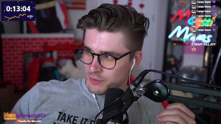
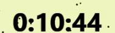

# Node OCR

This repository hosts an experiment with Tesseract OCR in Node I made. It uses
Tesseract to recognize the value of the countdown timer in Ludwig's Subathon
stream and updates the repository description to the found value.

## How it works

1. Download the Twitch stream preview in full size quality for best results

2. Detect the countdown timer region by looking for a blob of background color
3. Crop the top half of the region out of the preview image and invert it

4. Run Tesseract OCR on the extracted region image and limit it to digits
5. Run every 5 minutes using GitHub Actions and set the repository description

The image manipulation is done using Sharp.

## Status

This project will inevitably stop working once the Subathon ends and I don't
have anything else I could think of to recognize the value of continuously, so
whenever the stream ends, I will turn off Actions on this repository and note it
in this readme.
