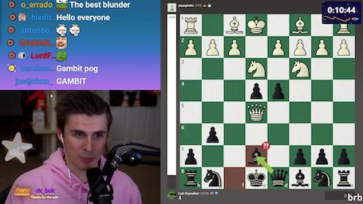

# Node OCR

This repository hosts an experiment with Tesseract OCR in Node I made. It uses
Tesseract to recognize the value of the countdown timer in Ludwig's Subathon
stream and updates the repository description to the found value.

## How it works

1. Download the Twitch stream preview in full size quality for best results

2. Detect the countdown timer region by looking for a blob of background color
3. Crop the top half of the region out of the preview image and invert it

4. Run Tesseract OCR on the extracted region image and limit it to digits
5. Run every 5 minutes using GitHub Actions and set the repository description

The image manipulation is done using Sharp.

## Status

The Subathon has ended around 2021-04-14 6:00 Prague, 21:00 Ludwig time zone.

I have disabled GitHub Actions on this project. I will use this repository as a
template for tracking something else like this if I can think of anything in the
future.
